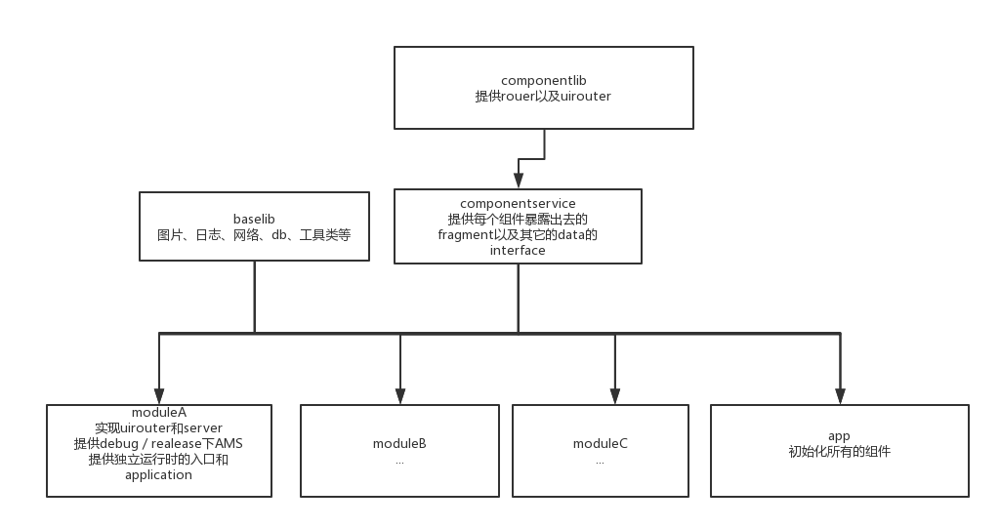

BaseAndroid项目文档
---------------
- [项目配置](#项目配置)
- [组件](#组件)
    - [注册／登陆](#注册/登陆)
- [注意](#注意)
    - [组件独立运行](#组件独立运行)
    - [多个application合并](#多个application合并)
    - [AMS区分组件独立运行和非独立运行](#AMS区分组件独立运行和非独立运行)
    - [Router](#Router)

---
### 项目配置
 * JDK版本：1.7
 * SDK适配版本：19 - 27
 * AS版本：3.0
 * gradle版本：4.1

---
### 组件
#### 注册/登陆

---
### 注意
提供一张简易结构图


#### 组件独立运行
在每个组件内的build.gradle里面添加
```
if (isApp.toBoolean()){
    apply plugin: 'com.android.application'
}else {
    apply plugin: 'com.android.library'
}
```
用gradle.properties isApp = false／true 控制是否开启组件是否独立运行


#### 多个application合并
在每个组件的srv/main/java包下建立一个isapp包，在debug里面建立组件独立运行时所需要的application,其它的测试用的Activity，Fragment等也可以放在这里面


### AMS区分组件独立运行和非独立运行
在main目录下创建isapp包，然后里面创建一个ams，注意里面绑定的application是java/isapp下面的application，作为独立运行的入口,并且在组件的build.gradle添加如下代码:
```
sourceSets{
        main{
            if (isApp.toBoolean()){
                manifest.srcFile 'src/main/module/AndroidManifest.xml'
            }else{
                manifest.srcFile 'src/main/AndroidManifest.xml'
                java{
                    exclude 'isapp/**'
                }
            }
        }
    }
```
控制独立运行的ams


----
### Router
Router的核心是Router类和UIRouter这两个类，即数据(Fragment,DB,Class)提供者以及路由跳转
所有组件对外暴露数据时，需要在componentservice注册，暴露接口，并且在组件中实现接口，组件中还需要一个专门提供组件注册的类
使用UIRouter时，不需要在componentservice中注册，但是需要在组件中去做一个中转路由，比如：LoginUIRouter，路由类中将提供这个组件中所有Activity的跳转
最后需要在项目的application中去注册，比如Router.reisterComponent("com.tapas.login.component.LoginComponentRegister");

为什么不直接调用，而是通过包名反射？
因为后面会编写gradle，将项目中app对各组件的依赖拿掉，这样在开发时形成完全的代码隔离，从未不会因为错误无法通过编译，在编译时会重新将依赖添加好


